# DECODE 4.0
DECODE 4.0 was a 24 hours cryptic hunt with clues scattered on the entire internet in RTE (Road to Elicit) event organized by **MUJ ACM SIGAI STUDENT CHAPTER**. This repository saves all the code that was used in the event. To run the same, create a MongoDB database with the given schema along with an oauth2 discord bot.


## Routes

#### HOME ROUTES
- `/`: Homepage
- `/leaderboard`: Check real-time leaderboard
- `/menu`: Open menu to select the next question to solve.
  - Each easy solve opens up medium as well as the easy for the next question.
  - Each medium solve opens up hard for the same question.
  - Each hard solves completes the question and marks the progress as **3/3 solved**.
- `/about`: Redirects to ACM's social page.
- `/login`: Redirects to discord oauth2 authentication page.

#### API ROUTES
- `/api/oauth2/discord`: From discord oauth2 page with token.
- `/api/check-answer`: Answer validation and progress tracker.

#### BACKLINK ROUTE
- `/backlink/{id}`: Acts as a backlink for the hunt.

#### LEVEL ROUTES
- `/level/{experiment}/{etype}`: Opens the exact same experiment with it's type. Only accessable if the conditions are met.
- `/level/escape-day`: 11th experiment. More of an epilogue and thank you message.

#### USERS ROUTES
- `/users/@me`: Opens your personal profile.
- `/users/{discord_id}`: Opens the user's profile. The ID is accesable via leaderboard.

#### SOCIALS ROUTES
- `socials/discord`: Redirects to discord server.


## MongoDB Schema
All collections:
- `announcements`: stores the annoncements.
- `questions`: all questions *(total 15x3 questions)*
- `users`: all user data.
- `solve matrix`: Keeps track of all the questions done by the user.

### Announcements
```json
{
    "_id": 12983712983, //timestamp in IST
    "title": "announcement title",
    "description": "event description, can be HTMl code"
}
```
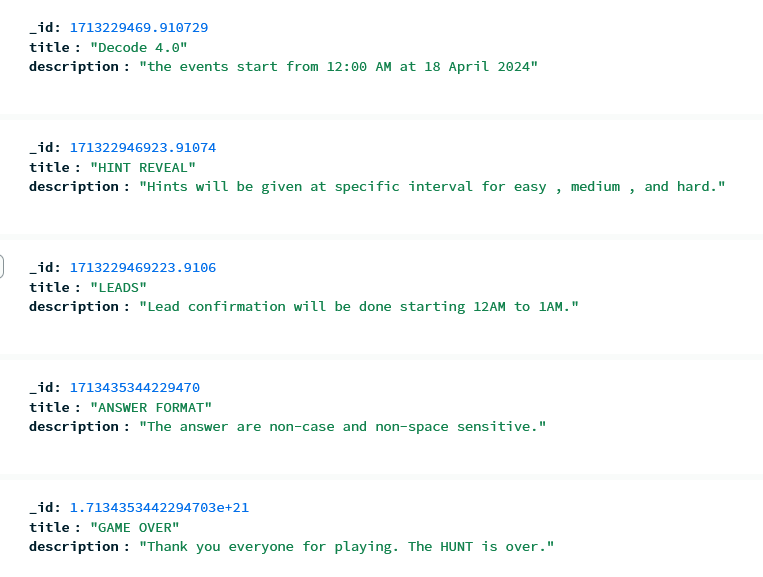

## questions
```json
{
    "_id": 123, // question number
    "easy":{
        "question": "some long text of question string",
        "img": "",
        "video": "<video>",
        "audio": "",
        "answer": "askjhd892e" // hashed password
    },
    "medium":{
        "question": "some long text of question string",
        "img": "",
        "video": "<video>",
        "audio": "",
        "answer": "askjhd892e" // hashed password
    },
    "hard":{
        "question": "some long text of question string",
        "img": "",
        "video": "<video>",
        "audio": "",
        "answer": "askjhd892e" // hashed password
    }
}
```
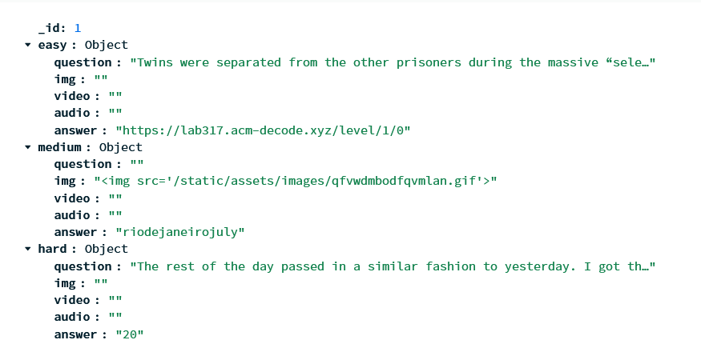


### solve matrix
```json
{
    "user": "2918371289327", // userID
    "experiment": 1, // experiment number
    "etype": 0, // experiment type (easy, medium, hard)
    "time": 2938729381232, // IST timestamp
}
```
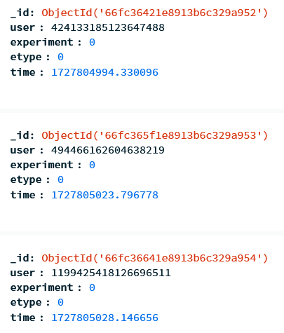

### users
```json
{
    "_id": 91371298312, // discord user ID
    "username": "pushkal",
    "avatar": "/static/avatar/ID.png",
    "discriminator": "0",
    "email": "randomemail@gmail.com",
    "token": "JWT user token",
    "points": 0193, // points gained via solving questions and easter eggs.
    "time": 19283719823, // last time the user sucessfully solved a question.
    "1-0":{
      "status": true, // true or false for solved or unsolved respectively
      // used for finding out the average and all.
      "start": 0 // if set to 0 then update it to the current timestamp and never update again
    },
}
```
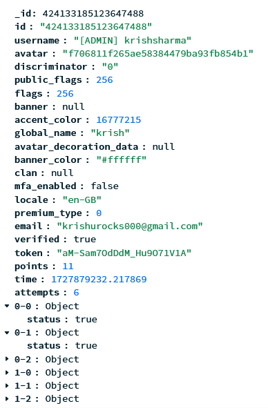

## Screenshots
`HOMEPAGE`
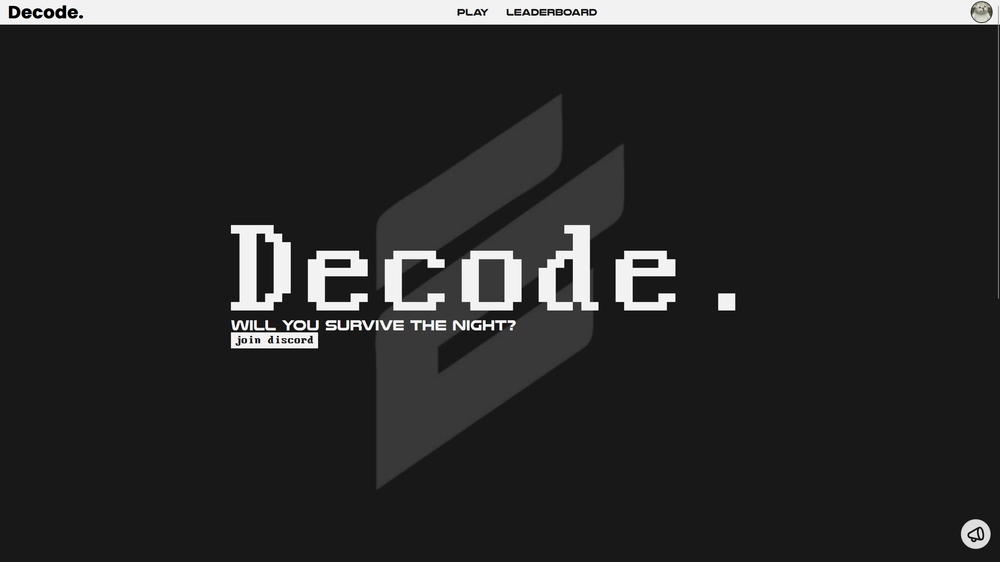
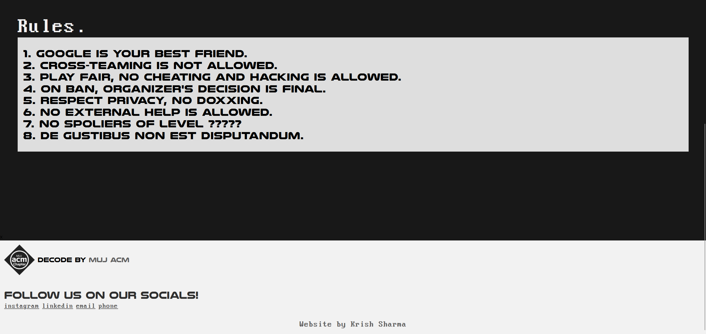

`MENU` (total 10 experiments but only 3 visible since easy of 2 isn't solved yet.)
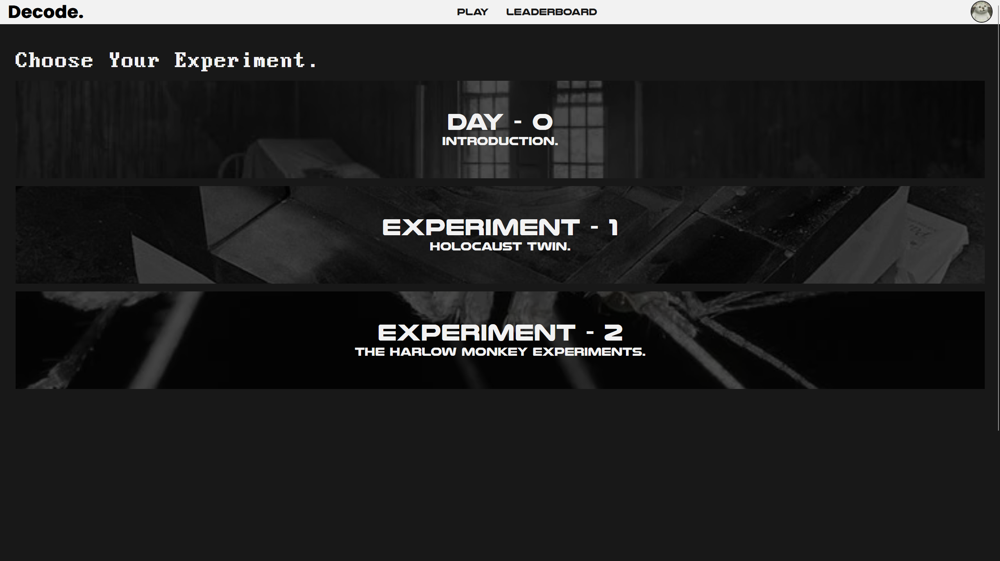
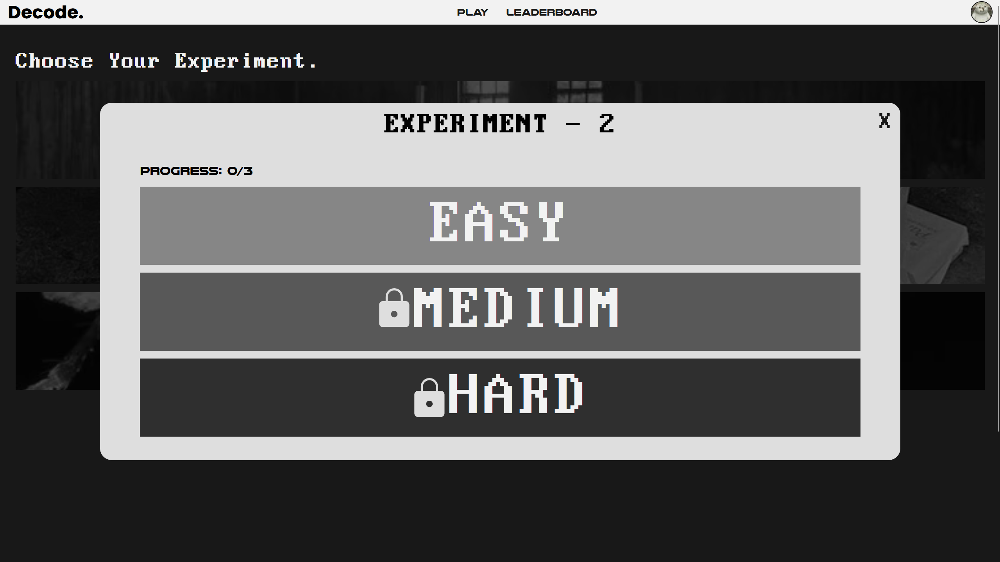

`LEADERBOARD`
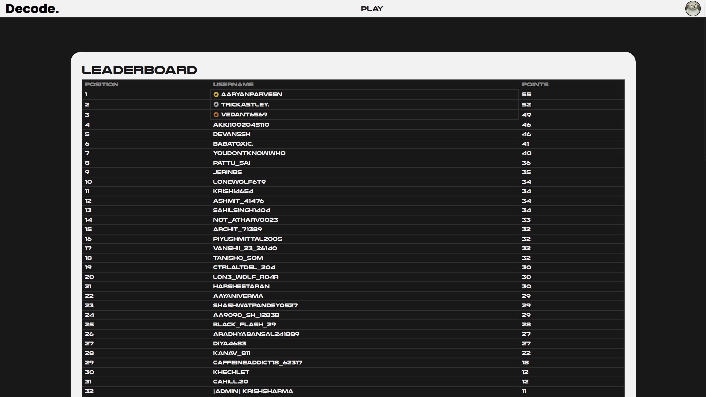

`USERS`
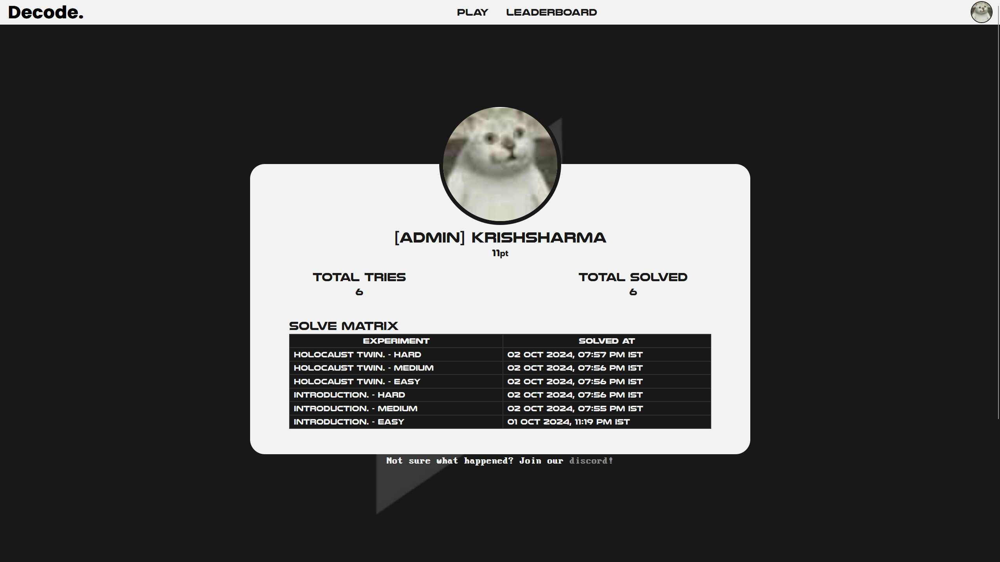

`LEVELS`: clues hidden within inspect tab.
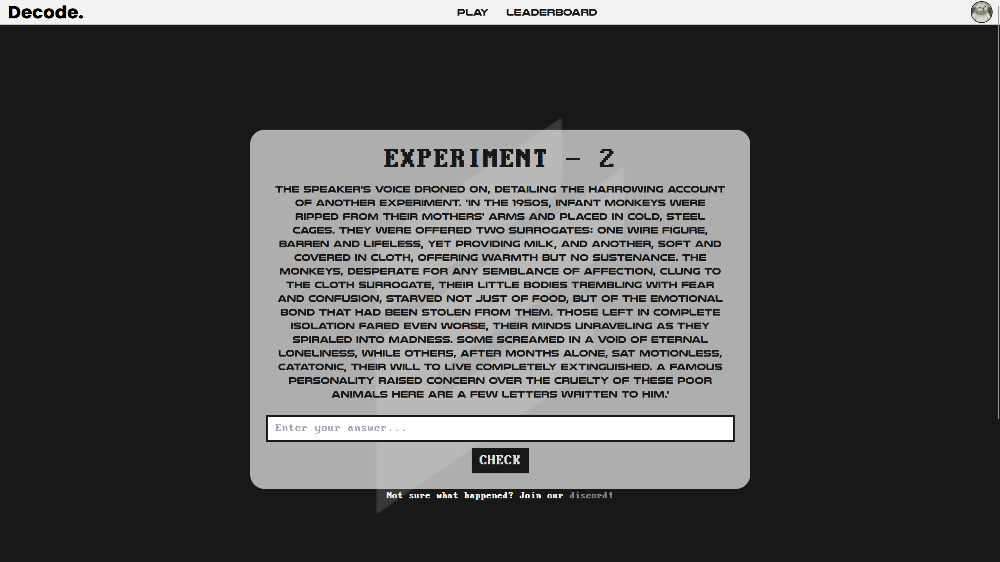
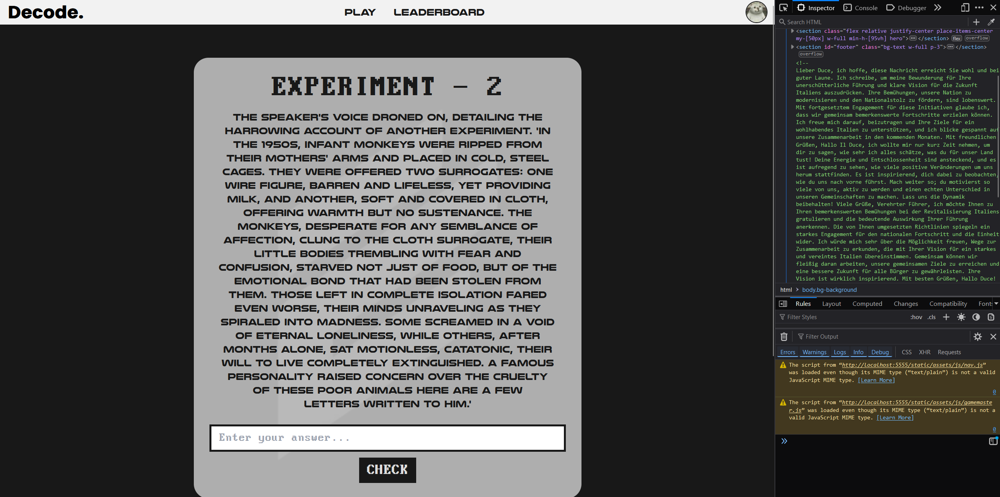


## credits
Thank you everyone for taking part in this event.

**Some positive feedback from the participants.**
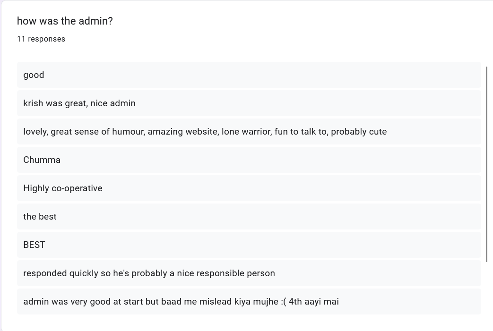
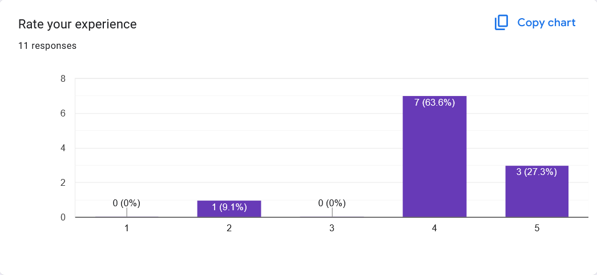
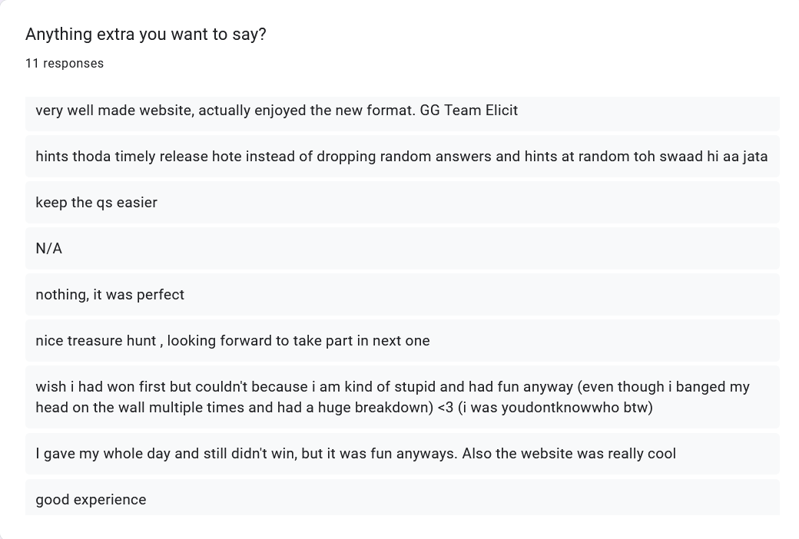